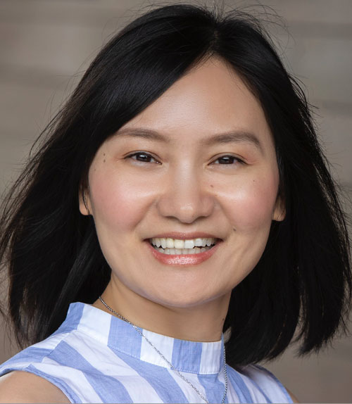
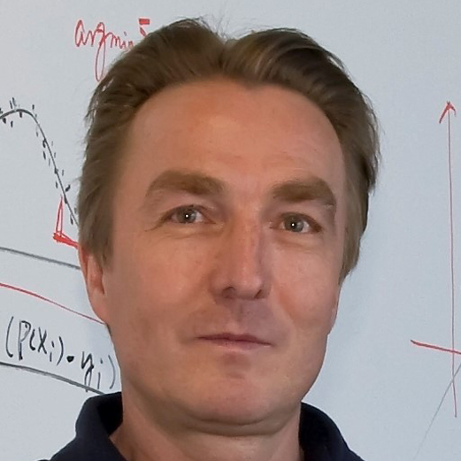
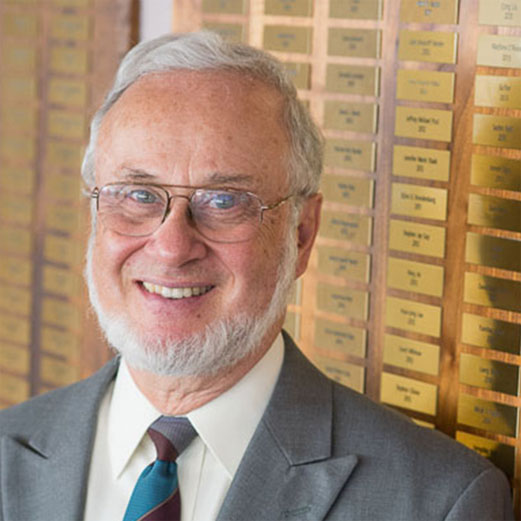

# Keynotes

## Miaomiao Zhang

Dr. Miaomiao Zhang is an Assistant Professor in Electrical and Computer Engineering and Computer Science at the University of Virginia. Her research work focuses on developing novel models at the intersection of mathematics, statistics, and computer engineering in the field of biomedical imaging. Dr. Zhang's current research projects include developing machine learning methods in image registration, segmentation, and shape analysis, with applications to cardiovascular imaging, neuroimaging, and computer-assisted surgery. Her work was recognized by numerous prestigious awards, including the MICCAI Young Scientist Award, the NSF CAREER Award, and the NIH Trailblazer Award. Dr. Zhang is a member of MICCAI society and has been actively serving as an area chair for MICCAI, ISBI, and MIDL.  
<b>Title:</b> Deep Neural Networks To Analyze Deformable Shapes From Images 
<b>Abstract:</b> The past decade has witnessed the success of deep neural networks (DNNs) in image processing and computer vision, achieving groundbreaking performance on specialized tasks such as image classification, segmentation, object detection, and tracking. Inspired by the human visual system, DNN models were widely believed to learn features from images including texture, color, and the shape of objects. However, recent studies have revealed that DNNs have a strong bias towards seeing image textures rather than shapes. The inability of DNNs to analyze shape as humans do limits their power and potential practical impact in applications where shape is important. In this talk, I will present our recent research on teaching DNNs to learn deformable shapes from images, and how this approach can be leveraged to improve current deep learning (DL) algorithms in image analysis and computer vision. Specifically, I will introduce a new family of low-dimensional shape representation learning algorithms based on fine-grained deformations derived from images.  I will also showcase the practical impact of this research in real-world clinical applications, such as neurodegenerative diseases (i.e., Alzheimer’s) detection and real-time image-guided navigation systems for neurosurgery.  

## Guido Gerig

Guido Gerig is Institute Professor and former Chair at the New York University (NYU) Tandon School of Engineering in the Department of Computer Science and Engineering, where he is also a member of the BME department and the VIDA center (visualization, imaging and data analysis). Guido Gerig was previously Assistant Professor at ETH Zurich (1993-1998), Taylor Grandy Professor of Computer Science and Psychiatry at the University of North Carolina at Chapel Hill (1998-2007), and USTAR Professor of Computer Science at the University of Utah (2007-2015). Guido Gerig has been named IEEE Fellow, class of 2019, Fellow of MICCAI (2019), and is also Fellow of the American Institute for Medical and Biological Engineering (AIMBE, 2011). His main research is in computer vision and medical image analysis with driving problems from medicine, tackled in close multidisciplinary collaboration between medicine, engineering, and statistics. His research supports a number of clinical imaging research studies with novel, innovative image analysis methodologies related to segmentation, registration, spatiotemporal modeling, shape analysis, and image statistics. Guido Gerig has published over 500 articles, most at high-impact events related to computer science and clinical research. New tools and methods, including itkSNAP and SlicerSalt, are developed as open source software and made available to the public, including teaching materials and hands-on training workshops.  
<b>Title:</b> Shaping up: Introduction to Shape Analysis 
<b>Abstract:</b> The study of shape and structure is a key research topic in image analysis and computer vision, and a crucial component in image processing applications related to biology, medicine, image indexing and searching, industrial inspection and robot vision, just to name a few. This presentation will give an overview of basic principles and concepts of shape representation and modeling, morphometric analysis, and shape statistics. This includes the discussion of general shape and landmark representations, morphometric shape metrics, morphometric transformations, shape descriptors, shape spaces, shape distributions, questions of homology, correspondence-free shape analysis, and concepts of shape recognition and classification.  

## Steve Pizer (To come in the Spring of 2024!!)

Dr. Steve pizer was the author of the first PhD dissertation in medical image computing, at Harvard and Mass. General Hospital in 1967. He has been teaching, research advising, writing, and doing research in that area continuously since then. In past years his research focused on image quality restoration, 2D and 3D display, and models of human vision. For the last decade he led research on computer vision methods using deep learning to reconstruct surfaces viewed by endoscopic video, most recently in colonoscopy. For the last 4 decades his focus has been on geometric models of anatomic objects, statistical analyses of these, and the applications of that in object segmentation, registration, and diagnosis. My medical target problems have come from radiation oncology, neuroscience, GI medicine, radiology, neurosurgery, and dentistry. The form of model he has developed is skeletal, and in particular what we call the s-rep, with its advantages over object boundary based models of also locally capturing curvature of the object interior and cross-object width. There have been successes of a variety of types for statistics on s-reps. These include the Slicer/SALT toolkit, operating as investigator, and the commercial success of the company, Morphormics, now part of Accuray, that Dr. Pizer and his team spun off and whose main product, doing segmentation originally built upon statistics of skeletal models and of the object-relative intensity patterns they allow, has measured success and is available in many hospitals.  
<b>Title:</b> Object Correspondence for Shape Statistics via Skeletal Geometry 
<b>** This keynote will happen virtually independently of this workshop **</b> 
<b>Abstract:</b> Accurate conclusions from object shape statistics depend on the quality of the positional correspondences among the objects that form the training population. These correspondences can be achieved by accurately making use of a rich collection of geometric properties of the objects. Many of the geometric properties traditionally used depend on relations derived from short geodesic arcs from point to point along the object’s boundary. Perhaps the most highly informative geometric representation based on the boundary points and possibly local normals are the momenta derived from LDDMM-generated diffeomorphisms. However, the curvature of the object interior as one moves along that interior can add information over boundary curvature, and object width as one moves along the interior has also been shown to be an informative property; the importance of both of those has been shown experimentally with numerous anatomic objects in a variety of diseased and non-diseased states. This presentation will discuss how both boundary geometric object properties and these object-interior geometric object properties can be captured by skeletal models that are obtained by model-maintaining diffeomorphisms of the object interior from an ellipsoid, designed to produce high correspondence. It will assess how using these features for classification between hippocampi related to autism affect the classification success.  

