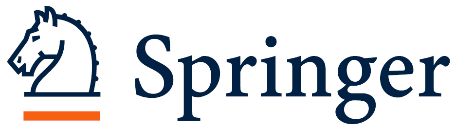

# Paper and Demo Submission

* **Papers**: Full papers (12-15 + pages, overall length including references) and short papers (6-11 pages) formatted in [LNCS style](https://www.springer.com/gp/computer-science/lncs/conference-proceedings-guidelines) (Template:    [Overleaf](https://www.overleaf.com/latex/templates/springer-lecture-notes-in-computer-science/kzwwpvhwnvfj), [Microsoft Word](https://resource-cms.springernature.com/springer-cms/rest/v1/content/19238706/data/v1)). Refer to [Instructions for Authors](https://resource-cms.springernature.com/springer-cms/rest/v1/content/19242230/data/v11).
* **Software Demos**: During paper submissions, you have the option to apply for presenting an on-site software demo.
* **Submission Portal**: [https://cmt3.research.microsoft.com/SHAPEMI2023](https://cmt3.research.microsoft.com/SHAPEMI2023)
* **Review**: The review is single-blind (submissions should include authors and affiliations). Reviewers will be chosen among experts in the medical image computing community.
* **Presentations**: The most original contributions will be selected for oral or poster presentations.

This year the conference will be hybrid, featuring on-site and virtual keynotes, as well as presentations of papers (oral and poster) and demos. For online presentations, authors of accepted papers are required to submit a pre-recorded presentation shortly before the workshop (date TBA). All video talks will be released to the workshop attendees, so people have time to watch them in advance and prepare questions. For on-site presentations, full presentation slides need to be sent to the organizers before the workshop. On the day of the workshop, all attendees will have the option to pitch their project live (on-site or virtually), which is followed by a short live discussion moderated by the chairs of each session.

* **Proceedings**: We plan on publishing the workshop proceedings in Lecture Notes in Computer Science (LNCS). We may not be able to include abstracts in the proceedings. 

Please note that at least one co-author **must register** to the workshop by the early bird registration deadline **August TBD 2023**.

